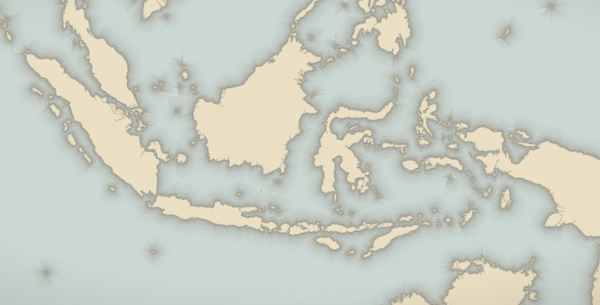
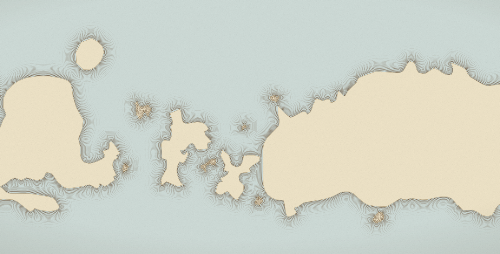
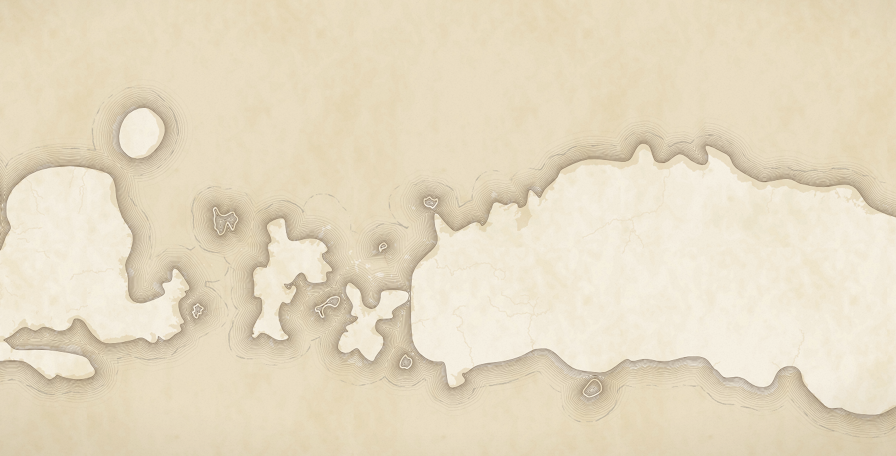

# waterlines

Old-map waterlines — the concentric ripples engravers drew around coastlines —
rendered on a 2D canvas over a live MapLibre GL or deck.gl map, and kept fast
enough that the map still moves at 60 fps.

The technique is [Olivia Vane's][notebook], from her Observable notebook
_Drawing waterlines on maps_. This repository ports it out of Observable, works
out what it takes to run it every frame instead of once per static image, and
applies it to the Indonesian archipelago.



```sh
npm run data     # rebuild data/ from Natural Earth (already committed)
npm start        # http://localhost:8080
npm test         # unit tests
node scripts/smoke.mjs   # end-to-end browser check with timings
```

Examples:

| page                                                                   | what it shows                                                                                               |
| ---------------------------------------------------------------------- | ----------------------------------------------------------------------------------------------------------- |
| [`examples/indonesia-maplibre.html`](examples/indonesia-maplibre.html) | The main one. Waterlines over Nusantara with style controls, four basemaps and a live frame-budget readout. |
| [`studio/index.html`](studio/index.html) (served at `/studio`)         | The same map and panel, plus: drop in your own GeoJSON, and save the result as a PNG.                       |
| [`examples/renderer-comparison.html`](examples/renderer-comparison.html) | The canvas renderer and the distance-field renderer side by side on one view.                             |
| [`examples/indonesia-deckgl.html`](examples/indonesia-deckgl.html)     | The same engine driven by a deck.gl viewport.                                                               |
| [`examples/still-gallery.html`](examples/still-gallery.html)           | No map: geometry fitted to a box, like the original notebook.                                               |

---

There is a longer write-up in [`docs/methodology.md`](docs/methodology.md): the
mathematics, the complexity analysis, the measurement protocol, the trade-offs,
and the things that did not work, which eventually lead to the current implementation.

## The technique

Waterlines are offset curves — line N sits _d_ pixels out from the shore. The
obvious way to get them is to buffer the coastline polygon N times, which is
what `@turf/buffer` does and why the original notebook warns you it will take
about forty seconds.

The fast version, and the one implemented here, never computes an offset curve
at all. It rasterises them:

```js
for (let i = 0; i <= count; i++) {
  const pen = penWidth(i); // widest first, narrowing inward

  ctx.lineWidth = pen + lineWeight(i);
  ctx.stroke(coastline); // a very fat line, centred on the shore

  ctx.globalCompositeOperation = "destination-out";
  ctx.lineWidth = pen;
  ctx.stroke(coastline); // erase its middle
  ctx.globalCompositeOperation = "source-over";
}
```

Stroking a path with a pen `w` wide covers everything within `w/2` of it.

### Two renderers

That loop is the **canvas renderer**, and it is a direct port of the notebook.
There is now a second one, and it is worth knowing which you are using.

Look at the loop again: every pass keeps the pixels whose distance to the shore
falls in a band. All N passes are slices of _one function_ — the distance to
the shore. Compute that function per pixel and every waterline can be read off
it in a single pass:

```glsl
float d   = distanceToShore(uv);              // jump flood, once per frame
float idx = pow((d - extent) / (inset - extent), 1.0 / spacing) * n;
float r    = radiusOf(floor(idx + 0.5));      // nearest waterline, exactly
alpha      = 1.0 - smoothstep(halfWidth, halfWidth + 0.5, abs(d - r));
```

`N` leaves the cost model entirely. Measured on an Intel Arc integrated GPU at
1440×900, time to produce one complete full-resolution picture:

| waterlines | canvas | WebGL |
| --- | --- | --- |
| 4 | 610 ms | 1.43 ms |
| 16 | 1107 ms | 1.45 ms |
| 64 | 4214 ms | 1.43 ms |

The ratio is not the point; the **slope** is. Linear versus flat. And because a
fresh picture costs about a millisecond, the GL path needs none of the
machinery the canvas path needs to stay interactive — no raster cache, no draft
ladder, no step scheduler, no precomputed animation frames. It just draws,
every frame, exactly.

Both are kept. `renderer: 'auto'` (the default) picks WebGL where it is
available and falls back to canvas where it is not:

```js
new WaterlinesOverlay(map, { data: land, renderer: "auto" }); // gl if possible
new WaterlinesOverlay(map, { data: land, renderer: "2d" }); // always canvas
```

The canvas renderer is not vestigial. It runs anywhere a canvas does, its
pixels are readable so it is what the studio's PNG export uses, and it is the
reference the GL path is checked against. It also composites overlapping bands
slightly differently — arguably less correctly, and arguably more attractively.
Judge for yourself at [`examples/renderer-comparison.html`](examples/renderer-comparison.html),
which runs both side by side on the same view. The full account is in
[`docs/methodology.md` §4B](docs/methodology.md).
Erasing a slightly narrower stroke leaves a thin rim at exactly `w/2` — a
waterline, at a known distance from the shore, produced entirely by the
rasteriser. Repeat with a narrowing pen and the rings nest inside each other.
Finally the land interior is punched out with `destination-out`, so the map
below shows through untouched.



Two consequences worth knowing:

- **The order cannot change.** Each pass erases inside the previous one, so
  passes must run outward-in. A half-finished render is not a valid picture —
  which is why the engine never displays one (see below).
- **The coastline must be smoothed first.** A wide pen amplifies every sharp
  vertex into a spike. The notebook uses d3's `curveCatmullRomClosed`;
  [`src/core/path.js`](src/core/path.js) is a dependency-free port of the same
  centripetal Catmull-Rom → cubic conversion. The still gallery has a
  side-by-side of what happens without it.

## Making it survive a live map

A static image can afford one slow render. A map cannot, and the cost here is
not geometry — it is _rasterised area_. Each pass paints a band `2 × extent`
wide along every visible coastline, twice. Over the whole archipelago that is
tens of millions of pixels per frame. No amount of vertex optimisation touches
it.

Five things make it work, roughly in order of how much they matter:

**1. Nothing is projected per frame.** At pitch 0 a Web Mercator view is
_exactly_ an affine transform of mercator space. So geometry is projected once
per zoom level into a `Path2D`, and a frame is a `ctx.setTransform` plus stroke
calls — JavaScript never touches a vertex.
[`src/adapters/transform.js`](src/adapters/transform.js) recovers those six
numbers from three `map.project` calls, which also picks up bearing for free.

**2. The rendered bitmap is reused.** At a fixed zoom and bearing, the waterline
image is _rigid_ under panning — the same picture, translated. It is rendered
into a canvas larger than the viewport and blitted while the view slides within
that margin. Zoom and rotation go through the same blit with a full affine;
line widths scale with the gesture, which is wrong, but only until the map
settles.

**3. Refreshes are spread across frames, and yield to the user entirely.** When
a new bitmap is needed it is rendered a few passes per frame into a second,
hidden canvas while the previous one stays on screen — the "show stale, render
fresh" contract a tiled basemap has. The step count is a feedback loop over the
observed frame interval.

But pacing alone is not enough, and it took measuring to see why: **one pass
over a continental coastline can cost more than a whole frame**, and a pass is
the smallest unit that leaves the bitmap in a valid state. No step count makes
that fit. So while the user is actually moving the map, a refresh stops dead
and the cached bitmap is blitted instead; it resumes when the gesture ends. The
only exception is a view the cache cannot cover at all, where something coarse
beats nothing. See [`src/render/RasterCache.js`](src/render/RasterCache.js).

**3b. Two rungs: draft, then crisp.** From cold, a full render of the whole
archipelago is a second or more, and staring at a bare map for that long is
worse than seeing soft waterlines quickly. So the first pass runs at half
resolution _and two levels of detail coarser_, which lands in ~0.3 s, and the
full-resolution pass replaces it. The geometry half is what matters: stroking a
path costs roughly what its vertex count costs and is nearly independent of how
many pixels it covers, so halving the resolution alone barely helped.

**4. Geometry is levelled and culled.** Simplification, smoothing and `Path2D`
construction happen once per integer zoom and are cached
([`LodPyramid`](src/core/LodPyramid.js)); rings outside the padded viewport are
dropped, and the culled path is cached until the visible set actually changes
([`VisiblePathCache`](src/render/VisiblePathCache.js)). A level is never built
mid-gesture — the nearest cached one is used and the right one is built on an
idle callback.

**5. Resolution is what gives way under load**, not the line count and not the
geometry. A refresh started mid-gesture renders at a lower pixel ratio, so the
lines stay in exactly the same _place_ and merely soften. Lines that move or
disappear are far more distracting than lines that blur.

### Three measurement traps

All of these cost me real time, so they are worth stating plainly.

**Timing the drawing calls measures nothing.** A 2D canvas records commands and
rasterises later, so `performance.now()` around 40 `stroke()` calls happily
reports 0.1 ms for work that drops frames. Everything here is paced by the
observed interval between frames instead.

**Forcing a flush to fix that is worse.** A 1×1 `getImageData()` does make the
timing honest — and costs more than the drawing it was measuring. Pacing by
frame interval needs no readback at all.

**A bigger frame budget can make things worse, not better.** Raising the budget
while the map is idle looks free — nothing is competing for the frame. It is
not: because the controller cannot see rasterisation cost, a larger budget just
means it submits the entire refresh in one frame, and the page locks up for
however long that takes. One modest budget, moving or not.

### What it actually costs

From `node scripts/smoke.mjs` at 1440×900 (Chrome headless, GPU rasterisation
on an Intel Arc iGPU), `antique` preset, whole archipelago = 712 visible rings:

| drag                                        | overlay off    | overlay on                |
| ------------------------------------------- | -------------- | ------------------------- |
| Nusantara z4.2                              | 16.4 ms median | 16.7 ms median (p90 17.6) |
| Sulawesi z6.0                               | 16.4 ms        | 16.5 ms (p90 17.6)        |
| Bali z8.3                                   | 16.6 ms        | 16.5 ms (p90 17.9)        |
| Banda z10.5                                 | 16.5 ms        | 16.5 ms (p90 17.8)        |
| Nusantara, **while a refresh is in flight** | —              | 16.6 ms (p90 19.1)        |

A locked 60 fps, indistinguishable from the map with no overlay at all. The
last row is the one worth having: dragging while the overlay is mid-refresh is
the case it is easy to test around by accident, and it is where the earlier
version of this code stuttered badly.

The work does not vanish, it moves. From cold at the heaviest view the draft
lands in about 0.3 s; the full-resolution pass behind it has measured anywhere
from **0.3 s to 4 s** across runs on this machine, depending on how the pacing
controller happens to be primed and what else the GPU is doing. That spread is
real and worth knowing about — it is a second or two of genuine rasterisation,
not a constant. It runs in the background and stops the moment you touch the
map. What it does not do is hide: while it runs and you are _not_ interacting,
the page's frames are long. Nothing is moving, so nothing shows; and the
instant a gesture starts it gets out of the way.

For a floor rather than a ceiling, `node scripts/smoke.mjs --swift` runs the
same checks on SwiftShader (slowly — it is software rasterisation). There a
full archipelago render is on the order of a second or two, and the map itself
is already down to ~28 ms frames before the overlay does anything.

## Using it

### MapLibre

```js
import { WaterlinesOverlay } from "./src/adapters/maplibre.js";

const land = await (await fetch("data/indonesia-land.geojson")).json();

const overlay = new WaterlinesOverlay(map, {
  data: land, // GeoJSON polygons of land
  style: { preset: "antique" },
});

overlay.setStyle({ count: 18, extent: 60 }); // cheap; wire it to a slider
overlay.setVisible(false);
overlay.remove();
```

The overlay draws from inside MapLibre's own `render` event, so the waterlines
and the basemap land in the same browser frame. It attaches to
`map.getCanvasContainer()`, below controls and markers.

### deck.gl

deck has no 2D-canvas layer type, and reimplementing this in WebGL would mean
giving up `destination-out` compositing — the whole trick. So the overlay keeps
its own canvas and takes deck's viewport:

```js
import { WaterlinesDeckOverlay } from "./src/adapters/deckgl.js";

const overlay = new WaterlinesDeckOverlay({
  container,
  data: land,
  style: { preset: "nautical" },
});

// deck stops drawing when idle, so give the overlay its own frame source.
const frame = () => {
  overlay.syncViewport(deckgl.getViewports()[0], { moving });
  requestAnimationFrame(frame);
};
requestAnimationFrame(frame);
```

Syncing is cheap when nothing has changed — the adapter compares transforms and
returns early. See [`examples/js/deck-app.js`](examples/js/deck-app.js).

### Without a map

```js
import { renderStill } from "./src/still.js";
document.body.append(
  renderStill(land, { width: 600, height: 600, style: { preset: "antique" } }),
);
```

### Animation

Off by default, and on either adapter:

```js
overlay.setAnimation({
  periodMs: 1600, // one full cycle
  direction: "outwards", // or "inwards"
  frames: 12, // pictures per cycle
});
overlay.setAnimation(null); // back to a still overlay
```

This is [Olivia Vane's animation notebook][anim] adapted to a view that can
move. Her reasoning carries over unchanged: the animation is a _loop_, so there
are only N distinct pictures however long it runs, and each one costs far too
much to draw per tick — so render them once and play them back. Over one cycle
every waterline travels outwards into the slot the line ahead of it occupied;
the innermost is born at the shore and the outermost fades out as it leaves, so
the loop closes without a jump. Reversing it is only reversing the frame order.

What it costs, plainly: settling on a new view now renders `frames` bitmaps
instead of one, so the waterlines take proportionally longer to appear, and the
loop holds `frames` viewport bitmaps in memory (about 5 MB each at 1440×900).
`WaterlineCycle`'s `budgetBytes` trims the frame count rather than let that run
away. Playback itself is free — one `drawImage` per frame — but the host map is
repainted continuously while it runs, which is not free on a laptop battery.
While the map is moving, or while a loop is being built, the still overlay is
shown instead: the animation pauses and resumes rather than competing with the
gesture.

Any single frame of the cycle is also just a style, so a still render can sit
anywhere in it:

```js
renderStill(land, { style: { preset: "antique", phase: 0.5 } });
```

[anim]: https://observablehq.com/@oliviafvane/iv-animating-waterlines-canvas-strokes

### Your own data, and saving a picture

[`studio/index.html`](studio/index.html), served at `/studio`, is the main example plus the two
things you need to use this on real work. Drop a GeoJSON anywhere on the page
(or pick a file, or paste a URL) and the waterlines redraw around it — polygons
or multipolygons, land or lakes or building footprints, anything with an edge.
Input is validated by running it through the same `geojsonToRings` the renderer
uses, so a file with no polygons is refused with a reason instead of rendering
as a blank overlay.

`Save PNG` composites the map canvas, the waterline canvas, the paper grain and
the vignette into one image. Three details make that less trivial than
`toDataURL`:

- the map has to be created with `preserveDrawingBuffer: true`, or WebGL
  discards its buffer and the basemap reads back transparent;
- the overlay may be showing a draft or a reduced-resolution bitmap, so the
  export waits for a full-quality one;
- above 1× the map container is temporarily grown, because MapLibre renders to
  the size it is given — there is no other way to make it draw more pixels.

See [`studio/js/export-png.js`](studio/js/export-png.js);
`renderExportCanvas()` gives you the composited canvas without saving it.

An engraved wind rose ([`studio/js/compass.js`](studio/js/compass.js)) can
be placed in any of the four corners, or turned off, with sliders for its size
and for its offset from the two edges of that corner. It counter-rotates with
the map bearing so its north stays true north, and — like the paper grain — it
is drawn with canvas rather than DOM precisely so the export can paint the same
thing, in the same place, at any scale.

The control panel folds away to a single `Controls` button — the toggle in its
header, or the `H` key — for framing a view without the panel covering
a quarter of it.

### Rhumb lines

The other thing an old chart has is the wind-rose web: the criss-crossing lines
of a portolan. [`studio/js/rhumb.js`](studio/js/rhumb.js) generates it, and two
facts make that cheap.

The construction is ruler-and-compass. Mark 16 equidistant points on a hidden
circle and join each to the others; the chord from vertex _j_ to vertex _k_ has
bearing `11.25° × (j + k) + 90°`, always a point of the 32-wind compass. So the
network is nothing more than "every line through a vertex whose bearing is a
multiple of 11.25°, clipped to the sheet" — 136 distinct lines, 36 principal
winds, 36 half, 64 quarter.

And in Web Mercator a loxodrome _is_ a straight line, which is why this belongs
to the map rather than to the canvas: a two-point `LineString` is at once a true
constant-bearing rhumb and a straight line on screen, so the whole web is a
GeoJSON source and three `line` layers — one per wind order, for the engravers'
black/green/red — with no per-frame cost at all. It reaches the PNG export for
free, because the export composites the map canvas.

Two modes, and the difference is the interesting part:

- **One rose** is what a chart actually had. Historically right, and it thins
  out as you zoom into it, exactly as the original would.
- **Lattice** puts a system in every quadtree cell instead, with the level
  following the zoom. Because Web Mercator _is_ a quadtree, raising the level by
  one per zoom step holds the weave at a constant size on screen — the same
  picture at every scale, which no real chart could manage. Only the cells in
  view are built, and it is rebuilt when the map settles.

Ported from the `rhumb-rose` sandbox, which worked out the maths and compared
three ways to deliver it — plain GeoJSON, baked vector tiles, and the
scale-free lattice. This is the first with the third on top; at 136 lines a
`geojson` source needs no tiling pipeline to keep up.

### Basemaps

The examples ship four, chosen to show the overlay staying in register with
things it knows nothing about:

| basemap                   | notes                                                                                                                                                  |
| ------------------------- | ------------------------------------------------------------------------------------------------------------------------------------------------------ |
| **Paper chart** (default) | Self-contained: background colour plus the same GeoJSON the waterlines use. No tile server, no key, nothing to expire.                                 |
| **Woodblock**             | OpenHistoricalMap's hosted CC0 vector style, from [pnorman/maplibre-styles][styles]. A woodcut paper pattern that suits the technique almost too well. |
| **Canvas-drawn land**     | The map draws only the sea; the overlay fills the land itself (`land: 'fill'`), as the notebook did.                                                   |
| **OpenStreetMap**         | Raster tiles. Demo use only — respect the OSM tile usage policy.                                                                                       |



Anything other than the paper style raises a registration question worth being
explicit about: the basemap's coastline and the waterlines' coastline are
different datasets. Natural Earth 10m generalises to a kilometre or two, so
against OSM the two agree at a glance around zoom 4–9 and visibly part company
above that. The fix, if you need one, is to feed the overlay the same
geometry your basemap draws.

## Style

All distances are in **CSS pixels, measured outward from the shore**, so the
ripples look the same at every zoom.

| option            | default       | meaning                                                                                        |
| ----------------- | ------------- | ---------------------------------------------------------------------------------------------- |
| `count`           | `12`          | number of waterlines                                                                           |
| `extent`          | `34`          | distance from shore to the outermost line                                                      |
| `inset`           | `2`           | distance to the innermost line                                                                 |
| `spacingExponent` | `0.7`         | below 1 crowds the lines against the shore, above 1 spreads them                               |
| `lineWidth`       | `[0.9, 0.45]` | visible width, `[innermost, outermost]`                                                        |
| `opacity`         | `[0.12, 1]`   | alpha, `[outermost, innermost]`                                                                |
| `color`           | `'#2f6f7e'`   | string, array, or `t => colour` with `t` = 0 innermost … 1 outermost                           |
| `filled`          | `false`       | solid graduated bands instead of lines                                                         |
| `land`            | `'clip'`      | `'clip'` punches out the land so the map shows through; `'fill'` paints it; `'none'` leaves it |
| `coastline`       | `null`        | `{ color, width, opacity }` drawn on top                                                       |
| `lineJoin`        | `'bevel'`     | `'round'` is prettier on sharp corners and markedly slower                                     |

Presets: `classic`, `antique`, `nautical`, `voronoi`, `bands` — see the
[gallery](examples/still-gallery.html).

**The setting people get wrong is spacing.** The gap between the two innermost
lines is roughly `(extent - inset) × (1 - ((count-1)/count) ** spacingExponent)`.
Raising `count` without raising `extent` with it drives that below a pixel and
the ripples fuse into a dark halo instead of reading as lines. Every preset
keeps the innermost gap above about 2 px.

Engine options (second argument to `WaterlinesOverlay`): `pixelRatio`,
`interactivePixelRatio`, `adaptive`, `frameBudgetMs`, `rasterPad`, `padding`,
`lod: { tolerancePx, minRingPx, curve, flatness }`, `onFrame`.

## Data

`data/*.geojson` are committed but generated. `scripts/build-data.mjs`
downloads Natural Earth 10m land and minor-island polygons (public domain),
clips them to a bounding box with Sutherland–Hodgman, drops sub-hectare rings
and quantises coordinates. No npm dependencies, so it will still run in five
years.

```sh
node scripts/build-data.mjs                 # every region
node scripts/build-data.mjs indonesia bali  # named regions
```

Regions are declared at the top of the script; add one by adding a bbox. Note
that the Indonesia bbox is deliberately far wider than the demo's camera: the
clip turns the bbox border into a dead-straight artificial coastline that grows
waterlines of its own, so it is pushed off screen rather than trimmed tight.
Pan to the far corners of the data and you will see it.

Land polygons rather than country polygons, incidentally — Borneo and New
Guinea are shared, and country outlines would draw waterlines along dry-land
borders.

## Layout

```text
src/
  core/            geometry, no rendering
    mercator.js      normalised Web Mercator, the shared coordinate space
    rings.js         GeoJSON -> flat typed-array rings with bboxes
    simplify.js      Ramer-Douglas-Peucker for closed rings
    path.js          centripetal Catmull-Rom -> Path2D, with flattening
    LodPyramid.js    per-zoom simplified + smoothed geometry, cached
  render/          drawing, no map
    WaterlineRenderer.js  the technique; also splits a frame into steps
    WaterlineEngine.js    canvas, LOD choice, refresh policy, adaptive quality
    RasterCache.js        double-buffered bitmap, blitting, paced refresh
    VisiblePathCache.js   viewport culling + combined-path cache
    style.js              presets, defaults, resolution
    scales.js             the two d3-scale functions this needs
    bounds.js             affine comparison and inversion
  adapters/        map integration, thin
    maplibre.js      binds the engine to a MapLibre map
    deckgl.js        binds it to a deck.gl viewport
    transform.js     recovers the mercator -> screen affine
  still.js         render to a standalone canvas, no map
scripts/
  build-data.mjs   Natural Earth -> clipped GeoJSON
  serve.mjs        zero-dependency static server
  browser.mjs      minimal Chrome DevTools Protocol driver
  smoke.mjs        end-to-end browser checks with timings
shared/          assets both the examples and the studio load:
  css/app.css            the map-page stylesheet
  js/waterline-controls.js  the panel both map pages share
  js/basemap.js          MapLibre style definitions
  js/controls.js         declarative form builder for the panel
  js/paper.js            grain and vignette, shared by screen and export
examples/        the demo pages, with js/ for their own wiring
studio/          served at /studio; js/ is split by function:
  js/studio.js           page wiring
  js/geojson-input.js    file, drag-drop and URL loading, with validation
  js/export-png.js       compositing and download
  js/compass.js          the engraved wind rose
  js/rhumb.js            the portolan wind-rose network, as map layers
tests/             unit tests for the pure maths
```

Zero runtime dependencies. MapLibre and deck.gl are optional peers, used only
by their adapters.

## Limitations

- **Pitch is not supported.** A tilted view is projective, not affine, and a 2D
  canvas has no perspective. The examples pin `pitch: 0`; bearing is fine.
- **Very dense coastlines at continental zoom are expensive.** The refresh
  never blocks a gesture, but it takes a visible moment to sharpen, and while
  it runs the page's frames are long. Fewer lines helps roughly linearly; so
  does a smaller `extent`.
- **The overlay is a separate canvas, above everything.** It cannot be
  interleaved into a MapLibre style, so basemap labels and roads sit under the
  waterlines rather than over them.
- **A third-party basemap draws a different coastline** from the one the
  waterlines are built from — see _Basemaps_ above.
- **Islands pop in.** Rings smaller than `lod.minRingPx` on screen are dropped;
  raise it to cull harder, lower it for more islets.
- Overlapping ripples from neighbouring islands blend twice where they cross.
  That is inherent to compositing successive strokes and is also what produces
  the pleasing near-Voronoi effect between close islands.

## Credit

- Technique: [Olivia Vane, _Drawing waterlines on maps_][notebook] — the
  `destination-out` formulation, the spacing and thickness scales, and the
  curve smoothing all come from there.
- The compositing explanation the notebook builds on:
  [Andy Woodruff, _Canvas cartography_](https://observablehq.com/@awoodruff/canvas-cartography-nacis-2019).
- Curve smoothing approach: [Nadieh Bremer, _Simplified curved earth map_](https://observablehq.com/@nbremer/simplified-curved-earth-map).
- Coastlines: [Natural Earth](https://www.naturalearthdata.com/), public domain.
- Basemap index: [pnorman/maplibre-styles][styles], which is where the
  Woodblock style came from. Woodblock itself is by
  [OpenHistoricalMap](https://github.com/OpenHistoricalMap/map-styles) (CC0);
  its tiles carry OHM/OpenStreetMap data and are attributed in the map.

MIT.

[@danylaksono](https://github.com/danylaksono)

[notebook]: https://observablehq.com/@oliviafvane/ii-drawing-waterlines-on-maps
[styles]: https://github.com/pnorman/maplibre-styles
